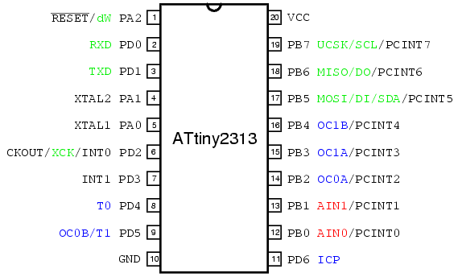
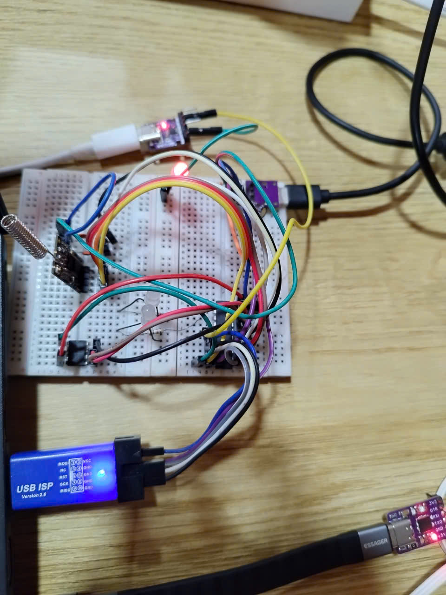
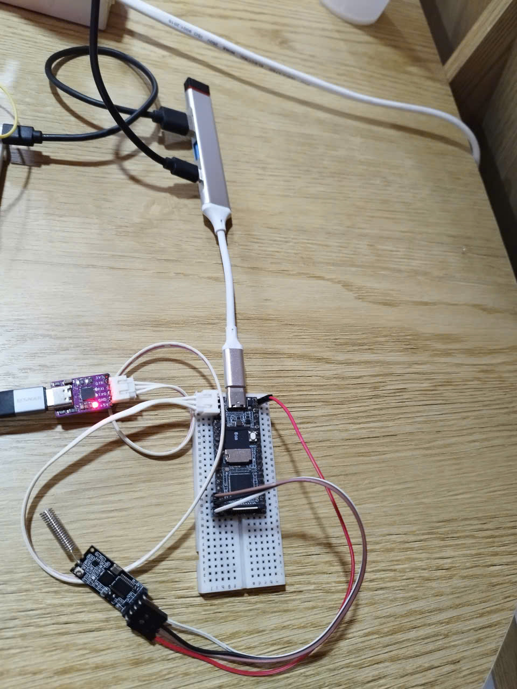
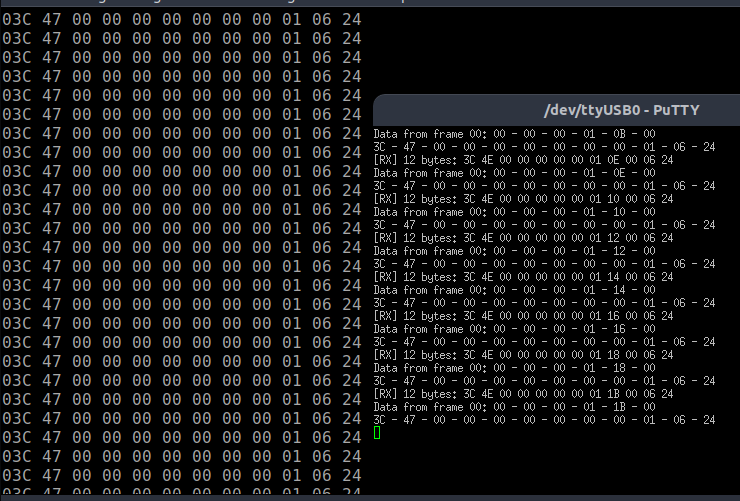
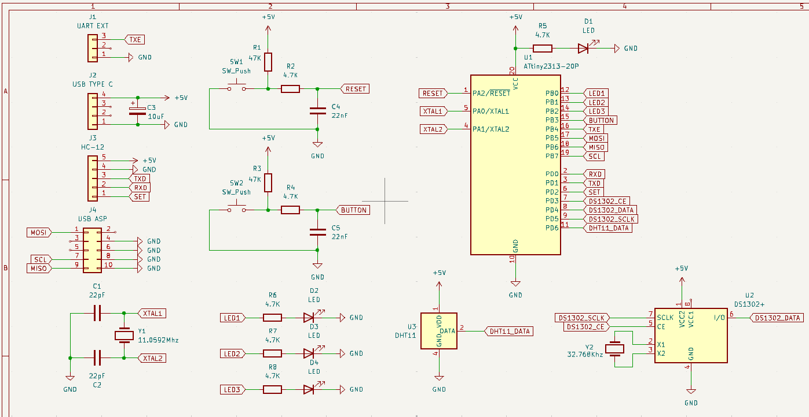
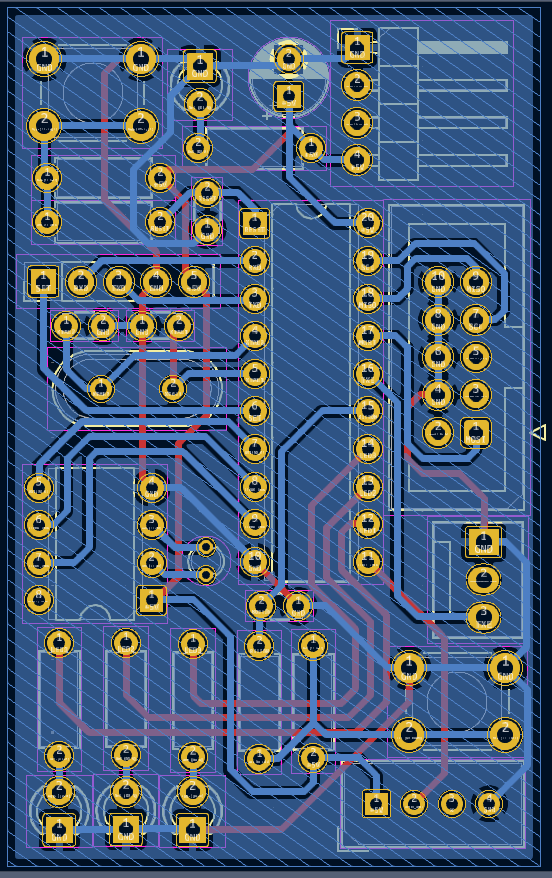

---

## Components

The system consists of two main components:

- **IoT Node** – a low-power microcontroller device
- **Gateway** – a Linux-based embedded computer acting as a central controller

---

## IoT Node (ATtiny2313)

### Description

The IoT Node is built using an **ATtiny2313** microcontroller.

Its responsibilities are:

- Reading sensor data or device status
- Packing data into a **fixed-length binary packet**
- Transmitting packets to the Gateway via UART or RF module
- Receiving control commands from the Gateway

The node firmware is written in **C**, runs without an operating system, and avoids dynamic memory allocation.

---

### ATtiny2313 Pinout

The pinout below is used as a reference for wiring **USART, GPIO, HC12 RF module, debug UART, and RTC peripherals**.



---

### Node Characteristics

- Microcontroller: **ATtiny2313**
- Architecture: AVR (8-bit)
- Programming style: Bare-metal
- Memory usage: Static allocation only
- Protocol: Custom fixed-length binary protocol

### Hardware Communication Design

The ATtiny2313 node is designed with **multiple communication interfaces**, each serving a specific purpose:

- **Hardware USART**
  - Used for communication with the **HC12 RF module**
  - Responsible for transmitting and receiving binary packets between Node and Gateway
  - Chosen for reliability and precise baud rate control

- **Software UART (Bit-banging)**
  - Implemented manually in firmware
  - Used only for **debug output**
  - Sends human-readable data (hex / ASCII) to a USB–TTL converter or serial monitor
  - Kept separate from the main communication channel to avoid protocol interference

- **DS1302 Real-Time Clock (RTC)**
  - Provides **real-time timestamp** for the node
  - Communicates via a simple 3-wire interface (CLK, DAT, RST)
  - Used to timestamp sensor data or events before transmission
  - Allows the system to keep time even when the gateway is offline

This separation of communication roles ensures:
- Stable RF communication
- Clear and independent debugging
- Accurate timekeeping at the node level

---

## Gateway (Luckfox Pico)

### Description

The Gateway is implemented on a **Luckfox Pico**, running **embedded Linux built with Buildroot**.

It acts as the central communication hub between multiple IoT nodes and is responsible for:

- Receiving data packets from nodes via HC12 (UART)
- Validating packet structure
- Parsing commands and payloads
- Executing gateway-side logic
- Sending response packets back to nodes
- Providing system time to nodes for RTC synchronization
- Preparing for future backend integration

---

## Rebuilding Embedded Linux (Buildroot)

The operating system for the Luckfox Pico is **rebuilt from source** using the official Luckfox Pico SDK.

### Official SDK Repository

Buildroot and kernel sources are provided by LuckfoxTECH:

🔗 https://github.com/LuckfoxTECH/luckfox-pico

Using this SDK allows full control over:

- Kernel configuration
- Device drivers
- Root filesystem
- Boot-time scripts
- Network configuration

This project **does not use the factory image**, but instead rebuilds the OS to match the system requirements.

---

## Power & USB Expansion

### USB Type-C Hub

A **USB Type-C hub** is used to:

- Provide stable power to the Luckfox Pico
- Expand USB ports for peripherals (WiFi, USB–UART, etc.)

Pinout and physical reference:


This setup ensures reliable power delivery while allowing multiple USB devices to be connected simultaneously.

---

## USB WiFi Integration

### WiFi Adapter

The gateway uses an external USB WiFi adapter:

- Chipset: **Realtek RTL8188FTV**
- Standard: 802.11 b/g/n
- Mode: 1T1R, 2.4 GHz
- Interface: USB

---

### Driver Build Process

The WiFi driver is **not included by default** and must be built manually.

Steps overview:

1. Enable USB WiFi support in Buildroot
2. Build the Realtek RTL8188FTV driver
3. Output driver module as a `.ko` file
4. Copy the driver to the root filesystem

Example driver output location: 

> /lib/modules/rtl8188ftv.ko


---

### Driver Load & Network Initialization Script

A custom startup script is written to:

- Load the WiFi driver
- Bring up the network interface
- Configure timezone
- Set system date/time

The script is placed in:

```c
#include <stdio.h>
#include <stdlib.h>
#include <string.h>
#include <unistd.h>

int main() {
    char buffer[128];
    FILE *cfg80211 = popen("insmod /lib/modules/cfg80211.ko", "r");
    if (cfg80211 == NULL) {
        perror("popen failed");
        return 1;
    }
    while (fgets(buffer, sizeof(buffer), cfg80211) != NULL) {
        printf("%s", buffer);
    }
    pclose(cfg80211);

    FILE *rtl8188ftv = popen("insmod /lib/modules/8188fu.ko", "r");
    if (rtl8188ftv == NULL) {
        perror("popen failed");
        return 1;
    }
    while (fgets(buffer, sizeof(buffer), rtl8188ftv) != NULL) {
        printf("%s", buffer);
    }
    pclose(rtl8188ftv);

    FILE *wpa_supplicant = popen("wpa_supplicant -B -i wlan0 -c /etc/wpa_supplicant.conf", "r");
    if (wpa_supplicant == NULL) {
        perror("popen failed");
        return 1;
    }
    while (fgets(buffer, sizeof(buffer), wpa_supplicant) != NULL) {
        printf("%s", buffer);
    }
    pclose(wpa_supplicant);

    FILE *udhcpc = popen("udhcpc -i wlan0", "r");
    if (udhcpc == NULL) {
        perror("popen failed");
        return 1;
    }
    while (fgets(buffer, sizeof(buffer), udhcpc) != NULL) {
        printf("%s", buffer);
    }
    pclose(udhcpc);
    
    FILE *ntpd = popen("ntpd -q -p pool.ntp.org", "r");
    if (ntpd == NULL) {
        perror("popen failed");
        return 1;
    }
    while (fgets(buffer, sizeof(buffer), ntpd) != NULL) {
        printf("%s", buffer);
    }
    pclose(ntpd);

    FILE *date = popen("date", "r");
    if (date == NULL) {
        perror("popen failed");
        return 1;
    }
    while (fgets(buffer, sizeof(buffer), date) != NULL) {
        printf("%s", buffer);
    }
    pclose(date);

    return 0;
}
```

---

## Communication Protocol

The system uses a **custom binary protocol** to ensure:

- Deterministic packet size
- Fast parsing
- Low memory overhead
- Reliability in embedded environments

### Packet Format

```c
typedef struct {
    uint8_t start;     // 0x3C '<'
    uint8_t header;    // 'N' (Node) or 'G' (Gateway)
    uint8_t id;        // Node ID
    uint8_t command;   // Command type
    uint8_t data[6];   // Payload
    uint8_t crc;       // Checksum
    uint8_t end;       // 0x24 '$'
} package_t;
```

---

---

## Experimental Hardware Setup

To validate the communication protocol and system design, the project is tested using a **physical testboard setup** for both the Node and the Gateway.

This experimental setup allows:

- Verifying UART and RF communication stability
- Observing real packet transmission and reception
- Debugging protocol behavior at byte level
- Validating time synchronization between Gateway and Node

---

### Node Testboard Setup

The Node is assembled on a **testboard** using the following components:

- ATtiny2313 microcontroller
- HC12 RF module (USART communication)
- USB–TTL converter (software UART for debug output)
- DS1302 RTC module
- Discrete components (resistors, capacitors)

The testboard setup enables easy probing, debugging, and modification during development.



---

### Gateway Testboard Setup

The Gateway is tested using a **Luckfox Pico** connected to external peripherals via a USB hub.

Components in the gateway test setup include:

- Luckfox Pico running custom Buildroot Linux
- USB Type-C hub for power and USB expansion
- USB WiFi adapter (RTL8188FTV)
- USB–UART adapter connected to HC12
- External RF module for node communication

This setup closely represents a real deployment scenario while remaining flexible for testing and debugging.



---

### Test Results (Terminal Output)

The following results are captured **directly from the Gateway terminal**, demonstrating real communication between the Node and the Gateway.

During testing, the system successfully performs:

- Continuous reception of binary packets from the Node
- Correct parsing of packet fields (START, HEADER, ID, COMMAND, DATA, CRC, END)
- Handling of time request commands from the Node
- Sending current system time from the Gateway back to the Node
- Stable operation without data loss or crashes

The terminal output below shows raw data reception, packet parsing, and response transmission in real time.



---

### Observations

- Packets are received with correct framing and expected length
- No corrupted packets were observed during continuous operation
- Time synchronization requests are handled correctly
- The Node successfully updates its DS1302 RTC using the received timestamp
- The Gateway remains responsive while running non-blocking I/O and multithreaded tasks

These results confirm that the **communication protocol, hardware setup, and software implementation** operate reliably on real hardware.

---

## Node Hardware Design (Schematic & PCB)

After validating the system using a testboard, the Node hardware is further developed into a **custom schematic and PCB design**.

This step represents the transition from **experimental wiring** to a **deployable embedded device**.

---

### Schematic Design

The schematic defines all electrical connections and components used in the Node, including:

- ATtiny2313 microcontroller
- HC12 RF module (USART interface)
- DS1302 RTC module
- Power supply and decoupling capacitors
- Programming and debug interfaces

The schematic is designed with simplicity and reliability in mind, ensuring:

- Stable power delivery
- Clear signal routing
- Minimal external components



---

### PCB Layout

Based on the schematic, a **custom PCB** is designed to:

- Reduce wiring complexity
- Improve signal integrity
- Increase mechanical stability
- Prepare the Node for real deployment

The PCB layout places RF, MCU, and power components carefully to minimize interference and ensure reliable communication.



---

### Design Validation

The schematic and PCB are reviewed to ensure:

- Correct pin mapping for ATtiny2313
- Proper routing of UART and RTC signals
- Adequate power filtering and grounding
- Compatibility with firmware and protocol design

This hardware design completes the Node development process from **concept → prototype → PCB**.
